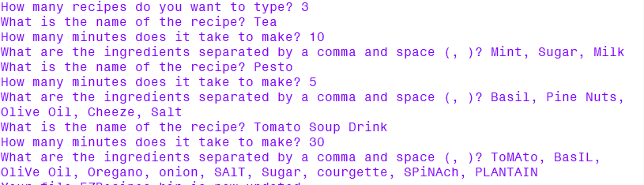
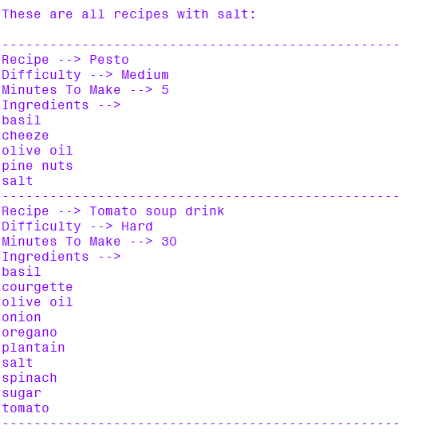

# CookingSort Input & Search

## About

CookingSort Input allows users to store recipes in the '.bin' format and uses Python including pickle. CookingSort Search allows users to open a '.bin' recipe file and display all recipes which contain a specific ingredient. It also functions using Python with pickle.

## How To Use CookingSort Input

+ You must first type the name of a file to add recipes to. If one exists the new content will be added to the current content. If one does not exist a new file will get created.
  
  

+ You must then type the quantity of recipes which you would like to add to the file.

  

+ For each recipe you must type the recipe name, time to cook and ingredients when requested. It is important to mention that the ingredients should be separated by a comma and space (, ) to be interpreted correctly by the programme.

  

+ Once you receive a notification that the file which you selected at the beginning is updated you can close the programme without losing info. Opening the file is not recommended because the information in it will not be readable.

  

## How To Use CookingSort Search

+ You must first type the name of a '.bin' recipe file to search for recipes in by ingredient.

  

+ A list of all ingredients will get displayed with numbers next to them. Choose a recipe by typing the number of it to see which recipes contain that ingredient.

  

+ The list of recipes containing the ingredient will be displayed on your screen.

  
