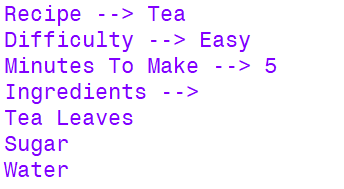
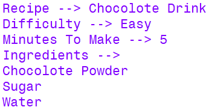
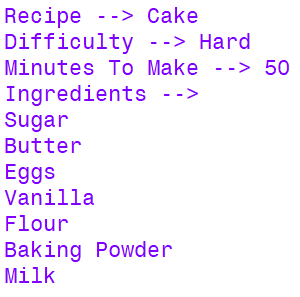
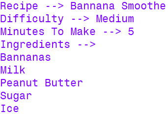
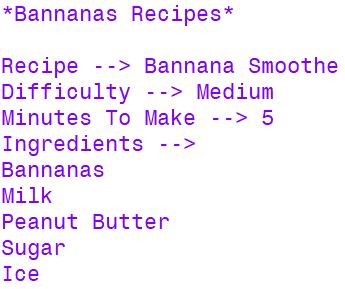
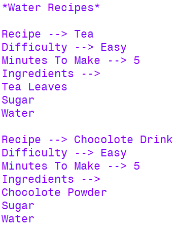

# Recipe Class Of Project Five

## Recipe Class Description

The class features the ability to store name, ingredients, cooking time and (auto generated/updated) difficulty.

## Init Of Recipe

To init a Recipe you must type `Recipe(<String Containing Recipe Name>)` and this will create a recipe with a `name` attribute which is equivalent to `<String Containing Recipe Name>`.

## Recipe Data Attributes

Recipe data attributes are here.

+ `name` : The string name of the Recipe which is defined on init.
+ `ingredients` : A list of the Recipe's ingredients in string format.
+ `cooking_time` : An integer which says how many minutes it lasts to cook the Recipe.
+ `difficulty` : An auto generated/updated string which gives an estimate of how difficult a Recipe is to prepare.
+ `all_ingredients` : A class variable list containing all ingredients used in all Recipe objects.

## Methods

+ `name` Methods
	+ `get_name()` : Returns `name` of a Recipe
	+ `set_name(<str>)` : Sets `name` of a Recipe
+ `cooking_time` Methods
	+ `get_cooking_time()` : Returns `cooking_time` of a Recipe
	+ `set_cooking_time(<int>)` : Sets `cooking_time` of a Recipe
+ `ingredients` Methods
	+ `add_ingredients(*<str>)` : Adds a variable quantity of ingredients to `ingredients`
	+ `get_ingredients()` : Returns `ingredients` of a Recipe
	+ `search_ingredient(<str>)` : Searches if an ingredient is in a Recipe and returns a boolean
+ `difficulty` Methods
	+ `get_difficulty()` : Returns `difficulty` of a Recipe
+ `all_ingredients` Methods
	+ `get_all_ingredients` : Returns `all_ingredients`
+ Other Methods
	+ `recipe_search(<list of Recipe>, <str>)` : Takes a list of Recipe objects and prints every one with an ingredient list which contains the inputted string
	+ `__str__()` : Returns a string representation of a Recipe (functions with `str()` notation too)

## Examples

These are some examples of string representation of Recipe objects and also demonstrate the automatically generated difficulties.

	

	

	

	

These are some samples of the use of `recipe_search` filtering the example recipes by ingredient.

	

	

	