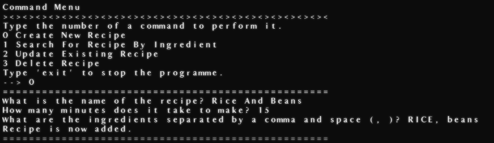
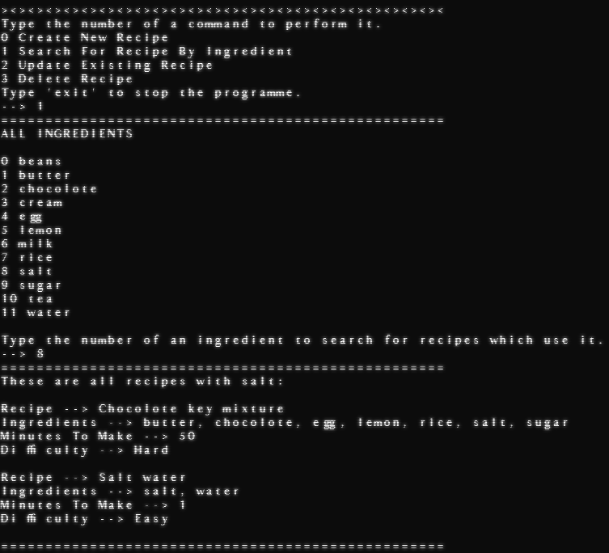
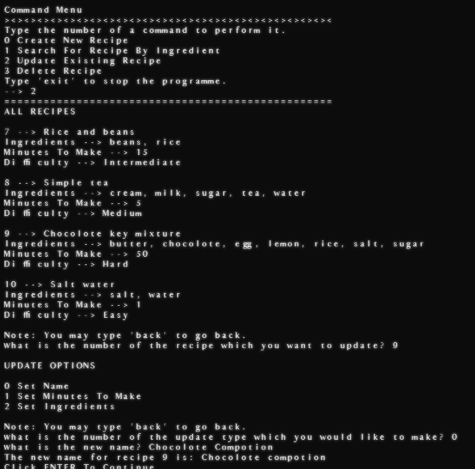
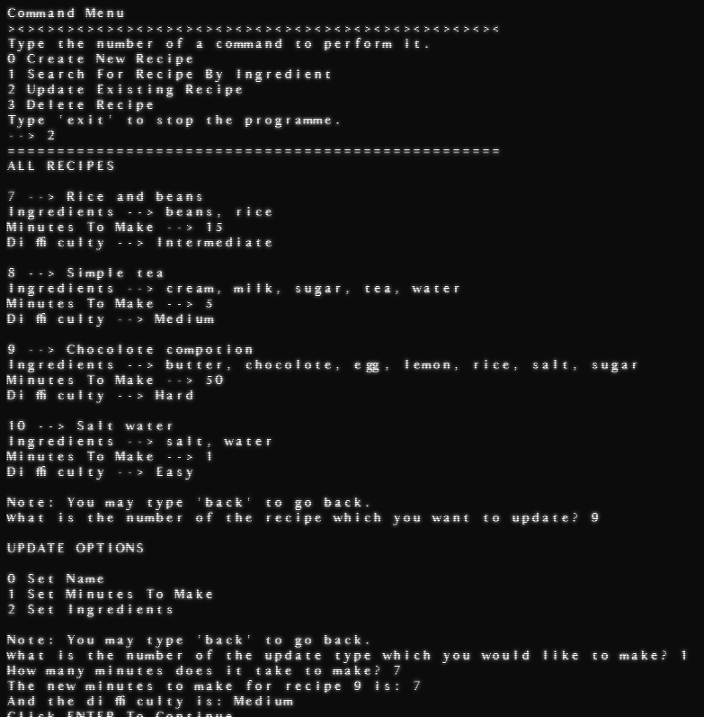
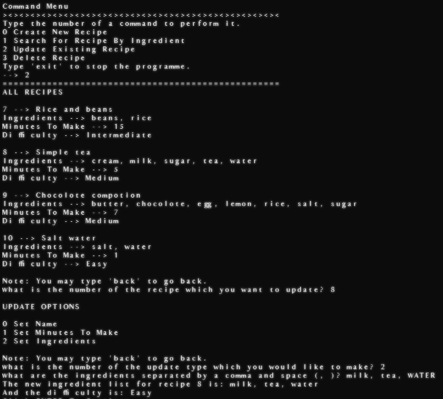
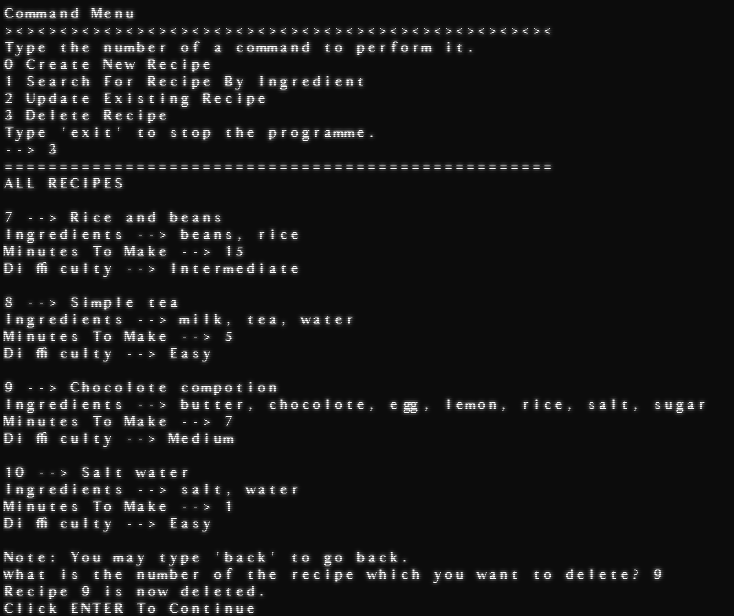

# RecipeManage Terminal App

## About The App

The RecipeManage App is one which can easily get used to create, search for and edit recipes. To start using it you just need to connect the py file to the appropriate database and then run the file in your terminal. Then follow the menu instructions.

## Main Menu

The main menu allows you to perform different commands. You can also use it to stop the programme by typing `exit`. You can perform the commands by typing their ID numbers:

+ `0` : Create New Recipe
+ `1` : Search For Recipe Based On Ingredient
+ `2` : Update Existing Recipe
+ `3` : Delete Recipe

## Create New Recipe

This image demonstrates the instructions which a user will receive to create a recipe successfully:

Minutes must be an integer and a comma and space '`, `' must be used in the middle of ingredients for the programme to count them correctly.

## Search For Recipe Based On Ingredient

This image demonstrates how to perform an ingredient search successfully:

Notice how you must type the integer which identifies an ingredient and not the actual name of it.

## Update Existing Recipe

Be careful here and remember that you can type `back` to go back before making updates. Here are examples of how to change a recipe name, minutes and ingredients in order:

The data formats should be identical to those used in the Create New Recipe section.

## Delete Recipe

Be careful here and remember that you can type `back` to go back and not delete anything. This is how to delete a recipe:

